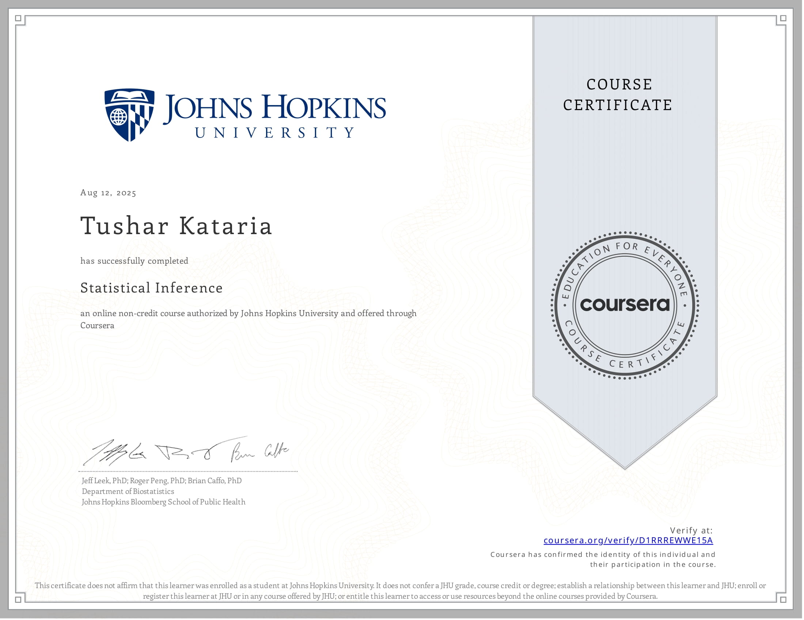

# Coursera-JHU-Statistical-Inference
Repository of my work for the [Statistical Inference course](https://www.coursera.org/learn/statistical-inference) created by Brian Caffo, Jeff Leek and Roger Peng from the Johns Hopkins Bloomberg School of Public Health, in the Department of Biostatistics. Within this, my work includes a series of four weekly multiple-choice quizzes (along with the R code I used to calculate my answers) and a two-part project comprising two PDF reports of a [Simulation Exercise](https://github.com/tk-0602/Coursera-JHU-Statistical-Inference/blob/d7f9187849cf87e7f582b5893ae60fdda5eea4d0/Project/Part%201%20-%20Simulation%20Exercise/Part_1_Simulation_Exercise.pdf) and a [Basic Inferential Data Analysis]() task. These reports were created as R Markdown (.Rmd) files which were then knit using `knitr` and compiled to PDF. Similarly, my answers to the quizzes were recorded in R Markdown files before being knit to standard markdown (.md) files.

## Course Content
The course is taught via 13 lectures split into several videos:

1. Introduction
2. Probability
3. Conditional Probability
4. Expectations
5. Variance
6. Common Distributions
7. Asymptotics
8. T confidence intervals
9. Hypothesis testing
10. P-values
11. Power
12. Multiple Testing
13. Resampling

Covering material from these videos, the quizzes centre around several specific lectures:

- [Quiz 1]() covers lectures 1 - 4
- [Quiz 2]() covers lectures 5 - 7
- [Quiz 3]() covers lectures 8 - 10
- [Quiz 4]() covers lectures 8 - 13

## Project

The final project is spilt into two parts:

- The first part was about simulating the exponential distribution in R using `rexp(n, lambda)` where lambda is the rate parameter (set to lambda = 0.2 here). Both the mean and standard deviation of this exponential distributiona are 1 / lambda. Then I compared the simulated distribution of averages of 40 exponentials to its theoretical counterpart and showed that the two are very similar (in the case of carrying out 1000 simulations) due to the Central Limit Theorem (CLT).
- The second part involved doing a basic inferential analysis on the `ToothGrowth` data in the R `datasets` package. The main task here was finding out whether differences the supplement types (ascorbic acid and vitamin C) and dosage levels (0.5, 1 and 2 mg) had an effect on the tooth growth in guinea pigs that the dataset records. For this, I started with some exploratory data analysis before using confidence intervals and basic hypothesis testing with t-tests.

## Course Certificate

View the certificate online [here](https://www.coursera.org/account/accomplishments/verify/D1RRREWWE15A)
